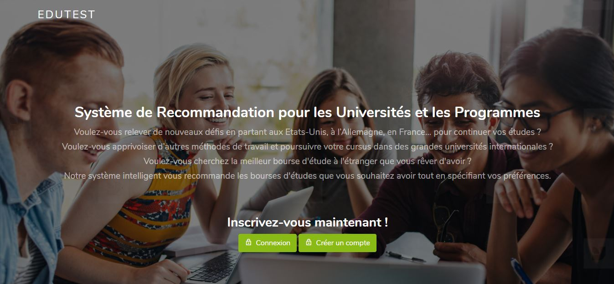
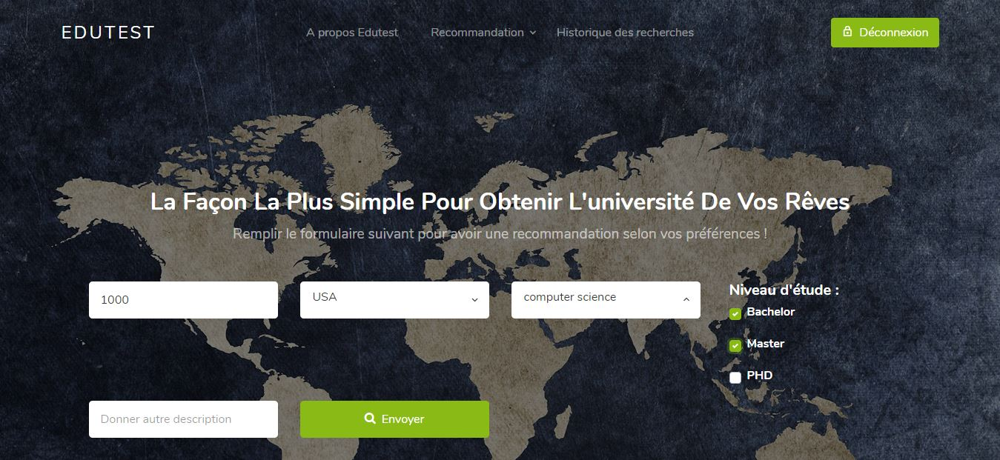
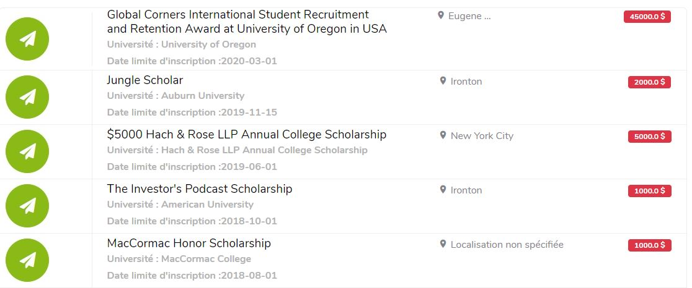
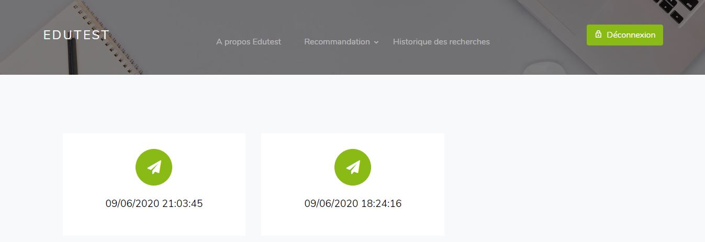
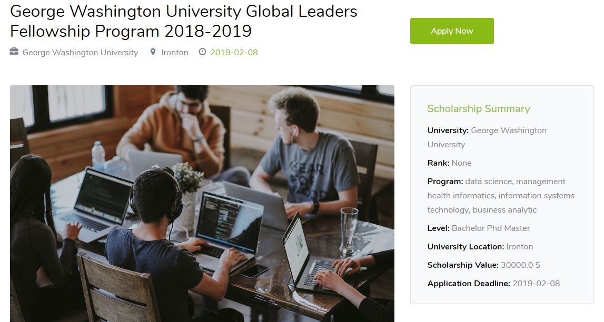
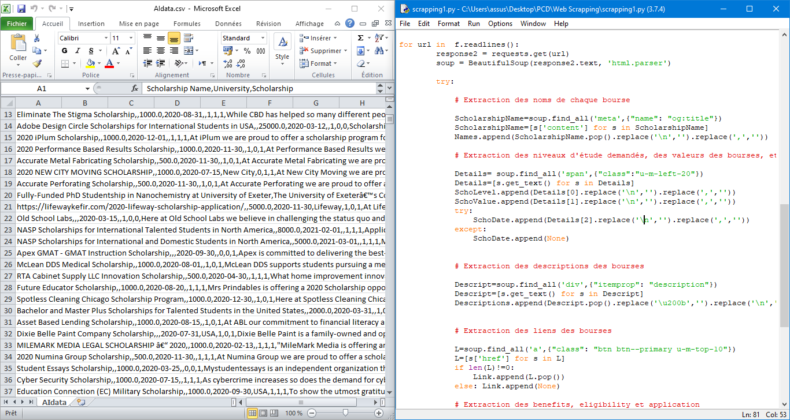
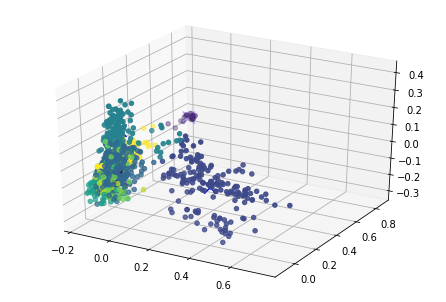

# Scholarship Recommendation System

This project is done with Edutest which is a Tunisian startup that connects pupils and students to universities and scholarships around the world.
In this internship, we were responsible for creating a recommendation system based on unsupervised learning that helps students to get the most interesting scholarship according to their preferences.

We began by the collect of data by scraping from differnet web sites using the python library BeatifulSoup, and we got text data so we must clean it and extract informations from it with spacy and NLTK (informations like the name of the university, the address, the rank,the level of study, the scholarship value, the deadline of the inscription, the link of the inscription, the program of study, a brief description of the university) and we had a data frame but sometimes with missing values so we used KNN to fill them.

After that we selected the attributes that we will use in the modeling which was unsupervised learning because the data is not labeled so we tried to cluster the most similar scholarships together we tested some algorithms such as Kmeans, Dbscan, Agglomerative, spectral, affinity...

And we developed a website with the framework Django where we deployed our model.

✅ Keywords: Python, Numpy, Pandas, ScikitLearn, Django, BeatifulSoup, Bootstrap, Scrum, Unsupervised Learning Clustering Algorithms.

Demo: https://youtu.be/9aIWrmgt91I

